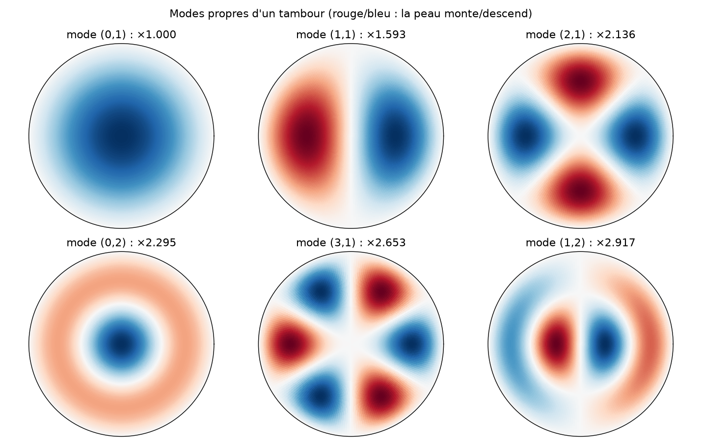

# 🥁 Le laboratoire de Bessel

Les fonctions de Bessel apparaissent dès qu'un problème a une symétrie circulaire ou
cylindrique : tambour, chaleur dans un cylindre, diffraction d'un télescope,
orbites de Kepler, synthèse sonore FM... Ce programme les explore par **15 cas
illustrés**, chacun **calculé** (jamais recopié), plus un quiz.



## Installation et utilisation

```sh
pip install -r requirements.txt
python BesselFunctions.py                        # menu interactif
python BesselFunctions.py --liste                # liste des cas
python BesselFunctions.py --cas tambour --cas fm # cas précis (répétable)
python BesselFunctions.py --tout                 # tout, figures à l'écran
python BesselFunctions.py --tout --sauver figures
python BesselFunctions.py --tout --sans-graphique
python BesselFunctions.py --quiz 10 --graine 42  # le Défi de Bessel
python -m pytest                                 # 62 tests
```

## Les 15 cas

| Cas | Ce que le programme montre |
|-----|----------------------------|
| `premieres` | J_n et Y_n (le tracé d'origine du dépôt), parité, singularité de Y_n en 0 |
| `equation` | résidu de l'équation de Bessel (et modifiée) ≈ 1e-14 pour ν entier ou non, Wronskien 2/(πx) |
| `serie` | la série entière et l'annulation catastrophique : 16 chiffres perdus à x = 40 |
| `integrale` | intégrale de Bessel, fonction génératrice, Jacobi–Anger, Σ J_n² = 1 |
| `recurrences` | récurrence montante instable contre algorithme de Miller stable |
| `asymptotique` | approximation de Hankel pour J_n, I_n, K_n aux grands x |
| `modifiees` | I_n, K_n, lien I_n(x) = i⁻ⁿ J_n(ix) |
| `zeros` | zéros entrelacés, écart → π, McMahon, Newton, zéros de J'_n |
| `spheriques` | j_n = √(π/2x) J_{n+½} = sin et cos ; récurrence |
| `tambour` | modes propres, fréquences inharmoniques ; chaîne pesante de Bernoulli |
| `fourier_bessel` | orthogonalité, développement de 1 − r², refroidissement d'un cylindre |
| `diffraction` | tache d'Airy, 1er zéro de J_1 → critère de Rayleigh 1,22 λ/D, 84 % de l'énergie |
| `fm` | synthèse FM vérifiée par FFT ; la porteuse disparaît à β = 2,4048 |
| `kepler` | E = M + 2ΣJ_n(ne)/n·sin nM, la série de Bessel (1824) contre Newton |
| `peau` | effet de peau : J_0 en argument complexe |

## Organisation

- `bessel.py` : implémentations indépendantes (série, intégrale, Miller, Hankel, McMahon, applications), comparées à `scipy.special`
- `illustrations.py` : les figures (`fig_*`)
- `quiz.py` : questions générées par calcul, reproductibles (`--graine`)
- `BesselFunctions.py` : interface en ligne de commande et cas illustrés
- `test_bessel.py` : tests numériques de chaque identité et de l'interface
